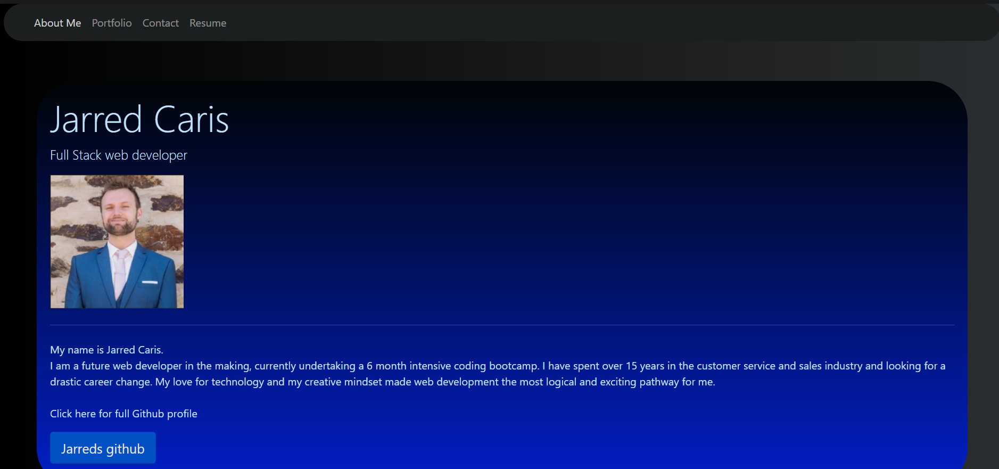

# updated_portfolio

# week_eight_homework

Updated Portfolio

## Week eight home work project

This weeks homework was to create an updated portfolio page with more features, as well as updating our information on several pages such as linkedin and github

## This is the end result

## Where to access code

updated portfolio git hub page.

## My contribution

For this page, i was initially going to be modifying my week 2 homework portfolio page. After some trialling, i was unhappy with how it was progressing and elected to start from scratch. I rebuilt the page from the ground up using Html, CSS and bootstrap for the framework.

I started looking at using JS for some added functionality but felt for the project, it was an uneeded addition. I learnt some new styling techniques which have really given the page a more updated look.

**explaining my page**

Im very pleased with my page. I feel its my most asthetically pleasing page to date and im happy with the overall look. 

I felt with the first portfolio, there was a lot of wasted space with the multiple page format. I elected to contain most of the information on a single page with a link to my resume on a seperate file due to its size.

I feel this gave the page a little more character and looked at what other developers were doing. i also wanted to add animations and a few other things but ran short on time so some features were unfortunately left out. 
 
[click for page link] (https://jarred-caris.github.io/updated_portfolio/.)